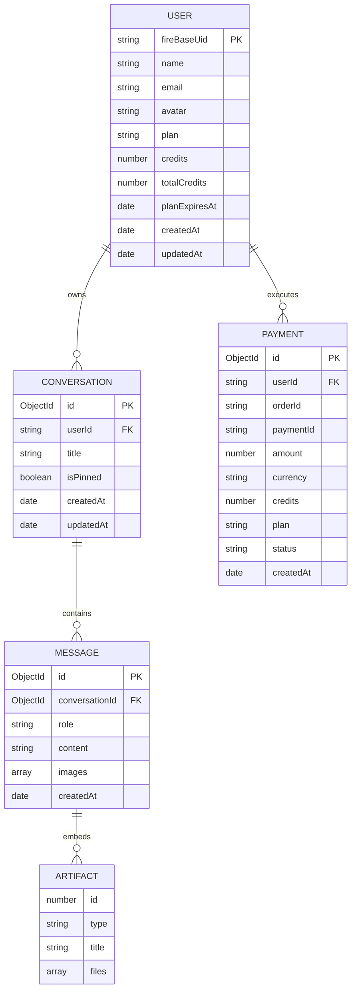
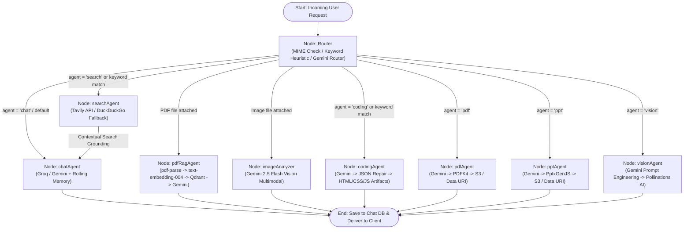

# MultiMind

> **Production-grade, distributed Multi-Agent AI platform featuring autonomous workflow orchestration with LangGraph, live web sandboxing, document RAG, multimodal vision, real-time web search, and credit-based subscription billing.**

[](https://github.com/himanshu-gupta15/MultiMind)
[](https://github.com/himanshu-gupta15/MultiMind)
[](https://github.com/himanshu-gupta15/MultiMind)
[](https://github.com/himanshu-gupta15/MultiMind)
[](https://github.com/himanshu-gupta15/MultiMind)

---

## Overview

**MultiMind** is an enterprise-ready, multi-agent AI system designed to eliminate the limitations of single-model chatbots. Instead of relying on a monolithic prompt, MultiMind dynamically routes user requests to specialized autonomous worker agents tailored for full-stack code generation, internet-augmented search, PDF Retrieval-Augmented Generation (RAG), PowerPoint slide generation, multimodal vision analysis, and generative image creation.

### Problem Solved
Traditional chat interfaces struggle with multi-disciplinary tasks: code generation lacks real-time runtime validation, general queries hallucinate outdated events, document analysis breaches token context limits, and multimodal interactions often degrade generation quality. 

### What the Application Does
MultiMind solves this through an end-to-end distributed system:
* **Autonomous Intent Routing:** Uses heuristic and LLM routers built on LangGraph to delegate queries to domain-specific agent graphs.
* **Interactive Code Sandboxing:** Generates valid, self-contained HTML/CSS/JavaScript applications rendered instantly in an isolated in-browser preview sandbox with Monaco Editor live editing.
* **Knowledge Retrieval & Multimodal RAG:** Chunks uploaded documents, computes semantic embeddings using Google Generative AI, performs similarity searches with Qdrant vector database, and executes visual QA on uploaded images.
* **SaaS Subscription & Credit Lifecycle:** Implements a tokenized credit economy backed by Razorpay payments, enforcing per-tier quotas, Redis-powered rate limiting, and automated usage deduction.

### Target Audience
Developers, researchers, knowledge workers, and technical teams seeking a unified workspace for accelerated development, document synthesis, and automated multimodal content creation.

---

## Key Features

### 🤖 Multi-Agent AI Orchestration (LangGraph)
* **Dynamic Routing:** Analyzes user prompts and attached MIME types via an autonomous router to invoke the optimal agent.
* **Conversational Agent:** Fast contextual conversation powered by Groq (`openai/gpt-oss-120b`) and Google Gemini (`gemini-2.5-flash`) with rolling 20-message memory.
* **Coding Agent & Artifact Engine:** Generates complete web applications (HTML, CSS, JavaScript) parsed with multi-stage regex repairs and resilient fallbacks, or provides in-depth code reviews, debugging, and architecture improvements.
* **Web Search Agent:** Real-time web querying with Tavily Search API and automated fallback to DuckDuckGo, injecting live search grounding into the synthesis layer.
* **Vision & Image Agent:** High-definition text-to-image synthesis using Pollinations AI with prompt enhancement, as well as multimodal image analysis (OCR, chart/diagram interpretation) via Gemini Vision.
* **Document Agents (PDF & PPT):** Autonomous generation of structured PDF documents (PDFKit) and downloadable PowerPoint presentations (`.pptx` via PptxGenJS).
* **Document RAG (Vector Search):** PDF text extraction (`pdf-parse`), semantic recursive chunking (`@langchain/textsplitters`), vector embedding generation (`text-embedding-004`), and similarity matching against Qdrant Vector Store.

### 💻 Interactive Code Sandboxing & Artifact Studio
* **Monaco Code Editor:** Integrated VS Code-like editor for reviewing and editing generated files (`index.html`, `style.css`, `script.js`).
* **Live In-Browser Sandbox:** Isolated `iframe` sandbox executing generated applications with automatic CSS/JS injection and viewport switches (Desktop, Tablet, Mobile).
* **Code Export & Reload:** One-click clipboard copy, live sandbox reset, and open-in-new-tab functionality.

### 🛡️ Authentication, Security & Sessions
* **Firebase Google OAuth:** Authenticates client-side Google identities and verifies tokens server-side with Firebase Admin SDK.
* **Redis-Backed Sessions:** Issues cryptographically secure session identifiers (`UUIDv4`) stored in Redis with 7-day TTL and transmitted via HTTP-only secure cookies or Authorization headers.
* **API Gateway Guard:** Validates session health at the perimeter, unpacks user profiles, and attaches downstream identity headers (`x-user-id`).
* **Granular Rate Limiting:** Per-user, per-agent sliding-window limits backed by Redis counters (`rate:{userId}:{agent}`) with dynamic TTL countdown feedback (HTTP 429).

### 💳 Billing & Tokenized Credit Economy
* **Razorpay Payment Gateway:** Secure order generation and HMAC-SHA256 signature verification.
* **Tiered Subscription Plans:** Configurable tiers (**Free**, **Starter**, **Pro**) with automated credit assignment and 30-day billing validity.
* **Action-Based Deductions:** Atomic credit deduction per agent execution (e.g., Chat: 1 credit, Search: 5 credits, Coding/PDF/PPT/Vision: 10 credits).

### 💬 Modern Workspace & Conversation Management
* **Chat Persistence:** Full conversation continuity across reloads using query parameters (`?c=<conversationId>`) and browser history `popstate` support.
* **Pinned Conversations:** Fast pinning and unpinning of critical threads displayed in dedicated sidebar sections.
* **Voice Input (Speech-to-Text):** Integrated Web Speech API for native voice dictation directly into the prompt bar.
* **Markdown & Syntax Highlighting:** Clean rendering of headings, tables, blockquotes, and Prism code syntax blocks with copy triggers.

---

## Complete Project Workflow

### 1. User Authentication & Session Flow
```
User (Browser) ──> Firebase Google OAuth Pop-up ──> Receives ID Token
      │
      └──> POST /api/auth/login { token } ──> API Gateway
                 │
                 └──> Auth Microservice 
                           │
                           ├── Verify token via Firebase Admin SDK
                           ├── Find or Create User in MongoDB ("auth" db)
                           ├── Generate crypto.randomUUID() session ID
                           ├── Store session payload in Redis ("session-{id}", TTL: 7 days)
                           └── Return Set-Cookie: session=<id> (HTTP-Only) + User Metadata
```

### 2. Multi-Agent AI Request Flow
```
User Prompt (+ Optional File) ──> Chatinput Component 
      │
      └──> POST /api/agent/chat (multipart/form-data)
                 │
                 ├── [API Gateway] ──> Validates session in Redis ──> Injects x-user-id
                 │
                 └── [Agent Service]
                           │
                           ├── 1. Check Redis rate limit: rate:{userId}:{agent} (max req/min)
                           ├── 2. Save User Message to Chat Service (MongoDB)
                           ├── 3. Execute LangGraph StateGraph:
                           │         ├── Node [router]: Heuristic / MIME check / Gemini LLM
                           │         ├── Conditional Edge: Route to Worker Node
                           │         │     ├── [chat]           ──> Groq / Gemini + Memory
                           │         │     ├── [coding]         ──> Gemini + JSON Artifacts Parser
                           │         │     ├── [search]         ──> Tavily / DuckDuckGo ──> [chat]
                           │         │     ├── [pdf] / [ppt]    ──> PDFKit / PptxGenJS ──> S3
                           │         │     ├── [vision]         ──> Prompt Expander ──> Pollinations
                           │         │     ├── [imageAnalyzer]  ──> Gemini Vision Multimodal
                           │         │     └── [pdfRag]         ──> text-embedding-004 ──> Qdrant
                           │         └── Node [__end__]: Aggregate answer, images, artifacts
                           │
                           ├── 4. Deduct User Credits via Auth Service (MongoDB + Redis)
                           ├── 5. Update Rolling Conversational Memory in Redis ("messages-{convId}")
                           ├── 6. Save Assistant Response & Artifacts to Chat Service
                           └── 7. Return JSON response to Frontend
```

### 3. Payment & Credit Allocation Flow
```
User selects Plan (Starter / Pro) ──> Billing Modal
      │
      ├──> POST /api/billing/create { plan } ──> API Gateway (injects x-user-id)
      │         │
      │         └──> Billing Service creates Razorpay Order & saves "created" Payment in MongoDB
      │
      ├──> Razorpay Modal opens on client ──> User completes payment
      │
      └──> POST /api/billing/verify { order_id, payment_id, signature }
                │
                ├── Billing Service verifies HMAC-SHA256 signature against RAZORPAY_KEY_SECRET
                ├── Mark Payment as "paid" in MongoDB
                ├── Call Auth Service (/update-plan) to credit user account
                └── Redis session cache invalidated/refreshed with new credit balance
```

---

## System Architecture

```mermaid
flowchart TB
    subgraph ClientLayer ["Client Layer"]
        Browser["User Browser (Desktop / Mobile)"]
        Voice["Web Speech Recognition API"]
        Monaco["Monaco Code Editor & Sandbox"]
    end

    subgraph CDNLayer ["Edge & CDN (AWS)"]
        CloudFront["AWS CloudFront CDN"]
        S3Frontend["AWS S3 Bucket (Static Assets / Dist)"]
    end

    subgraph GatewayLayer ["API Perimeter"]
        Gateway["API Gateway (Express :8000)"]
        AuthMiddleware["Session Protect Middleware"]
    end

    subgraph CachingLayer ["State & In-Memory Store"]
        Redis[("Redis (:6379)\n- Sessions (7d TTL)\n- Rate Limits (60s TTL)\n- Chat Memory (24h TTL)")]
    end

    subgraph MicroservicesLayer ["Backend Microservices (Docker / AWS ECS)"]
        AuthService["Auth Service (:8001)\nFirebase Admin & Credits"]
        ChatService["Chat Service (:8002)\nThreads, Messages, Artifacts"]
        AgentService["Agent Service (:8003)\nLangGraph Multi-Agent Engine"]
        BillingService["Billing Service (:8004)\nRazorpay Order & Verification"]
    end

    subgraph DatabaseLayer ["Database Layer (MongoDB Atlas)"]
        AuthDB[("auth DB\n- users")]
        ChatDB[("chat DB\n- conversations\n- messages")]
        BillingDB[("billing DB\n- payments")]
    end

    subgraph ExternalServices ["External Cloud & AI Ecosystem"]
        Firebase["Google Firebase Auth"]
        Razorpay["Razorpay Payments"]
        Groq["Groq API (GPT-OSS-120B)"]
        Gemini["Google Gemini (2.5 Flash / Vision)"]
        Tavily["Tavily Search API"]
        Qdrant["Qdrant Vector DB"]
        S3Storage["AWS S3 (Document & Image Artifacts)"]
        Pollinations["Pollinations AI (Image Gen)"]
    end

    Browser <--> CloudFront
    CloudFront <--> S3Frontend
    Browser <--> Gateway

    Gateway --> AuthMiddleware
    AuthMiddleware <--> Redis
    Gateway -->|/api/auth/*| AuthService
    Gateway -->|/api/chat/*| ChatService
    Gateway -->|/api/agent/*| AgentService
    Gateway -->|/api/billing/*| BillingService

    AuthService <--> AuthDB
    AuthService <--> Redis
    AuthService <--> Firebase

    ChatService <--> ChatDB
    ChatService <--> Redis

    AgentService <--> Redis
    AgentService --> ChatService
    AgentService --> AuthService
    AgentService <--> Groq
    AgentService <--> Gemini
    AgentService <--> Tavily
    AgentService <--> Qdrant
    AgentService <--> S3Storage
    AgentService <--> Pollinations

    BillingService <--> BillingDB
    BillingService <--> Razorpay
    BillingService --> AuthService
```



---

## Tech Stack

| Category | Technology | Purpose |
| :--- | :--- | :--- |
| **Frontend Framework** | React 19, Vite 8 | High-performance reactive Single Page Application |
| **State Management** | Redux Toolkit (`@reduxjs/toolkit`, `react-redux`) | Centralized state for conversations, messages, artifacts, and user |
| **Styling & Animation** | Tailwind CSS v4, Framer Motion (`motion`) | Modern glassmorphism UI, smooth transitions, responsive drawer |
| **In-Browser IDE** | Monaco Editor (`@monaco-editor/react`) | Interactive multi-file code editing for generated artifacts |
| **Markdown Rendering** | `react-markdown`, `remark-gfm`, `react-syntax-highlighter` | Styled Markdown tables, headings, and code syntax highlighting |
| **API Gateway** | Express 5, `express-http-proxy`, `cors`, `cookie-parser` | Centralized reverse proxy, route routing, header enrichment |
| **Backend Services** | Node.js, Express 5, ES Modules | Microservices (Auth, Chat, Agent, Billing) |
| **Multi-Agent Engine** | LangGraph (`@langchain/langgraph`), LangChain Core | Cyclic directed state graph, conditional branching, router nodes |
| **LLM & Vision Models** | Google Gemini 2.5 Flash, Groq GPT-OSS-120B, OpenRouter | Text generation, code writing, intent routing, multimodal OCR |
| **Vector Database & RAG**| Qdrant Vector Store, Google `text-embedding-004` | PDF semantic search, document embeddings, chunked QA |
| **Web Search** | Tavily Search API, DuckDuckGo Scraper | Real-time web retrieval with automatic fallback |
| **Document Generation** | `pdfkit`, `pptxgenjs`, `pdf-parse` | PDF creation, PowerPoint presentation generation, PDF text parsing |
| **Image Generation** | Pollinations AI REST API | High-resolution text-to-image synthesis |
| **Database** | MongoDB Atlas, Mongoose 9 | Database-per-service architecture (`auth`, `chat`, `billing`) |
| **Caching & Memory** | Redis (`ioredis`) | Session store, conversational memory, sliding window rate limits |
| **Authentication** | Firebase Authentication, Firebase Admin SDK | Client Google sign-in and server-side cryptographic token verification |
| **Payment Gateway** | Razorpay Node SDK, Webhook HMAC Verification | Indian Rupee (INR) order creation, checkout modal, signature verification |
| **Object Storage** | AWS S3 (`@aws-sdk/client-s3`), Presigner | Upload and secure URL generation for generated documents/images |
| **DevOps & Containers** | Docker, Docker Compose, AWS ECR, AWS ECS | Containerization of services, cluster task definition deployment |
| **Hosting & CDN** | AWS S3, AWS CloudFront | Static frontend asset hosting and global edge caching |
| **CI/CD** | GitHub Actions (`.github/workflows/deploy.yml`) | Automated build, Docker push to ECR, ECS force deploy, CloudFront invalidate |

---

## Project Structure

```text
cortexAI/
├── .github/
│   └── workflows/
│       └── deploy.yml               # Automated AWS ECS + S3/CloudFront CI/CD pipeline
├── backend/
│   ├── docker-compose.yml           # Local development composition (Redis)
│   ├── package.json                 # Shared root dependencies
│   ├── gateway/                     # Central API Gateway (Port 8000)
│   │   ├── Dockerfile
│   │   ├── index.js                 # Proxy routes, CORS, cookie/header parsing
│   │   ├── controllers/
│   │   │   └── user.controller.js   # Current user profile endpoint (/api/me)
│   │   ├── middleware/
│   │   │   └── auth.middleware.js   # Redis session token verification
│   │   └── utils/
│   │       └── proxyWithHeader.js   # Proxies request and injects x-user-id
│   ├── shared/                      # Shared internal modules
│   │   └── redis/
│   │       └── redis.js             # Singleton ioredis client connection
│   └── services/
│       ├── auth/                    # Auth Microservice (Port 8001)
│       │   ├── Dockerfile
│       │   ├── index.js
│       │   ├── config/              # DB and Firebase Admin initialization
│       │   ├── controllers/         # Login, logout, credit deductions, plan upgrades
│       │   ├── models/              # User Mongoose schema
│       │   └── routes/              # /login, /logout, /update-plan, /deduct-credits
│       ├── chat/                    # Chat Microservice (Port 8002)
│       │   ├── Dockerfile
│       │   ├── index.js
│       │   ├── config/              # DB connection
│       │   ├── controllers/         # CRUD conversations, messages, pin toggling
│       │   ├── models/              # Conversation & Message Mongoose schemas
│       │   └── routes/              # Conversation & message endpoints
│       ├── agent/                   # Agent Microservice (Port 8003)
│       │   ├── Dockerfile
│       │   ├── index.js
│       │   ├── agents/              # Individual worker agent implementations
│       │   │   ├── chat.agent.js
│       │   │   ├── coding.agent.js
│       │   │   ├── imageAnalyzer.agent.js
│       │   │   ├── pdf.agent.js
│       │   │   ├── pdfRagAgent.agent.js
│       │   │   ├── ppt.agent.js
│       │   │   ├── search.agent.js
│       │   │   └── vision.agent.js
│       │   ├── config/              # S3, Qdrant, Rate Limits, LLM model providers
│       │   ├── controller/          # Agent execution controller with 60s timeout
│       │   ├── graph/               # LangGraph StateGraph, Router, State annotation
│       │   ├── routes/              # POST /chat (Multer single file upload)
│       │   └── utils/               # PDFKit, PptxGenJS, S3 presigners, credit client
│       └── billing/                 # Billing Microservice (Port 8004)
│           ├── Dockerfile
│           ├── index.js
│           ├── config/              # Razorpay SDK & Plan definitions
│           ├── controllers/         # Order creation & HMAC signature verification
│           ├── models/              # Payment Mongoose schema
│           └── routes/              # /create, /verify
└── frontend/                        # React 19 + Vite 8 SPA Client
    ├── index.html
    ├── vite.config.js
    ├── src/
    │   ├── App.jsx
    │   ├── main.jsx
    │   ├── index.css
    │   ├── components/
    │   │   ├── Artifact.jsx         # Monaco Editor & in-browser iframe sandbox
    │   │   ├── BillingDraw.jsx      # Pricing plan drawer & Razorpay checkout
    │   │   ├── ChatArea.jsx         # Main messaging layout wrapper
    │   │   ├── Chatinput.jsx        # Input bar, agent switcher, speech recognition
    │   │   ├── MessageBubble.jsx    # Formatted Markdown, syntax blocks, lightbox
    │   │   ├── MessageList.jsx      # Message feed and auto-scroller
    │   │   ├── Nav.jsx              # Mobile navigation and app bar
    │   │   └── Sidebar.jsx          # Conversation list, pinning, user profile
    │   ├── features/                # Axios API service integrations
    │   ├── pages/
    │   │   └── Home.jsx             # Main dashboard & Google sign-in modal
    │   ├── redux/                   # Redux Toolkit store, conversationSlice, etc.
    │   └── utils/
    │       ├── axios.js             # Axios instance with Bearer interceptors
    │       └── firebase.js          # Client Firebase initialization
```

---

## API Architecture

All client requests are routed through the **API Gateway** on port `8000`. Protected endpoints require an active Redis session verified by the gateway before routing to internal services.

### API Gateway Routes (`http://localhost:8000`)
| Method | Endpoint | Protection | Description |
| :--- | :--- | :--- | :--- |
| `GET` | `/` | Public | Gateway health check |
| `GET` | `/api/me` | Protected | Returns current authenticated user metadata |
| `ALL` | `/api/auth/*` | Public / Hybrid | Proxies to Auth Service (:8001) |
| `ALL` | `/api/chat/*` | Protected | Proxies to Chat Service (:8002) with `x-user-id` |
| `ALL` | `/api/agent/*` | Protected | Proxies to Agent Service (:8003) with `x-user-id` |
| `ALL` | `/api/billing/*` | Protected | Proxies to Billing Service (:8004) with `x-user-id` |

---

### Authentication Service (`http://localhost:8001`)
| Method | Endpoint | Body / Params | Description |
| :--- | :--- | :--- | :--- |
| `POST` | `/login` | `{ token: string }` | Validates Firebase token, upserts User, creates Redis session |
| `GET` | `/logout` | Header / Cookie | Destroys Redis session and clears `session` cookie |
| `POST` | `/update-plan` | `{ userId, plan, credits }` | Updates user tier and increases credit balance |
| `POST` | `/deduct-credits`| `{ userId, agent }` | Deducts credits based on agent execution cost |

---

### Chat Service (`http://localhost:8002`)
| Method | Endpoint | Body / Params | Description |
| :--- | :--- | :--- | :--- |
| `POST` | `/conversations` | `{ title?: string }` | Creates a new conversation for `x-user-id` |
| `GET` | `/get-conversations`| None | Fetches all conversations sorted by pinned & recency |
| `GET` | `/get-conversation/:id` | `:id` | Fetches a single conversation by ID |
| `POST` | `/save-message` | `{ conversationId, role, content, images, artifacts }` | Appends a user or assistant message |
| `GET` | `/get-messages/:conversationId` | `:conversationId` | Retrieves complete chronological message history |
| `POST` | `/update-conversation` | `{ id, title }` | Renames conversation title |
| `POST` | `/toggle-pin/:id` | `:id` | Toggles pinned status for a conversation |
| `DELETE`| `/delete/:id` | `:id` | Deletes conversation, related messages, and Redis cache |

---

### Agent Service (`http://localhost:8003`)
| Method | Endpoint | Form Data | Description |
| :--- | :--- | :--- | :--- |
| `POST` | `/chat` | `prompt`, `conversationId`, `agent`, `file?` | Orchestrates LangGraph execution and returns AI response, images, artifacts |

---

### Billing Service (`http://localhost:8004`)
| Method | Endpoint | Body / Params | Description |
| :--- | :--- | :--- | :--- |
| `POST` | `/create` | `{ plan: "starter" \| "pro" }` | Creates Razorpay order and saves pending payment |
| `POST` | `/verify` | `{ razorpay_order_id, razorpay_payment_id, razorpay_signature }` | Verifies HMAC-SHA256 signature and grants credits |

---

## Database

MultiMind uses **MongoDB** following the **Database-per-Service** microservice pattern. Each service manages its own isolated database instance.

### Entities & Data Flow



* **Data Isolation:** User records live in the `auth` database, conversations and message logs in `chat`, and transactions in `billing`.
* **Cascade Invalidation:** Deleting a conversation triggers a cascade delete across all associated messages in MongoDB and evicts key `messages-${conversationId}` from Redis.

---

## Authentication & Security

1. **Token Exchange & Session Generation:** The client signs in via Google OAuth with Firebase. The raw token is sent to `/api/auth/login`, where Firebase Admin validates the cryptographic signature. Once confirmed, a 128-bit UUID session key is generated.
2. **Dual-Transport Sessions:** Sessions are stored in Redis under `session-${sessionId}`. The session key is delivered back via:
   * `httpOnly`, `secure`, `sameSite: none` (or `lax` on localhost) cookies.
   * `Authorization: Bearer <sessionId>` header fallback via Axios request interceptors.
3. **Internal Identity Propagation:** Downstream microservices are inaccessible from the outside. The API Gateway verifies the session in Redis and decorates internal proxied requests with the verified user ID in the header `x-user-id`.
4. **Payment Cryptographic Integrity:** All Razorpay transactions require HMAC-SHA256 signature matching against `RAZORPAY_KEY_SECRET` before plan activation.
5. **Sliding-Window Rate Limiting:** Enforces maximum request limits per minute per agent (e.g., 20 requests/minute for chat, 5 requests/minute for coding/vision/PDF) using Redis atomic increments (`INCR`) and expirations (`EXPIRE 60`).

---

## AI/ML Architecture



### Agent Engine Details
* **State Management (`agentState`):** Uses LangGraph annotations to manage immutable state across nodes, containing `prompt`, `aiResponse`, `agent`, `searchResults`, `images`, `artifacts`, `userId`, and uploaded `file`.
* **Resilient Model Switching:** Integrates `@langchain/groq` for ultra-low latency conversational responses with automatic fallback to `@langchain/google-genai` (`gemini-2.5-flash`) if Groq keys are absent or rate-limited.
* **JSON Artifact Extraction:** The coding agent features a resilient 4-tier JSON recovery algorithm:
  1. Direct `JSON.parse`
  2. String newline/tab sanitizer regex
  3. File entry key-value regex extractor
  4. Markdown block code fence parser (````html`, ````css`, ````javascript`)

---

## Caching & Performance

* **Session Cache:** Redis caches session data (`session-${sessionId}`) with a 7-day TTL, reducing database reads on every authenticated API request.
* **Conversational Memory Window:** Redis caches the last 20 messages per conversation (`messages-${conversationId}`) with a 24-hour expiration, feeding conversation context directly to the LLM without database queries.
* **Dynamic Rate Limit Counters:** Redis keys `rate:${userId}:${agent}` count requests with a 60-second sliding expiration.
* **Optimized Timeout Wrappers:** All agent invocations are guarded by a 60,000 ms timeout race to ensure hung LLM streams or network stalls fail gracefully with HTTP 504.

---

## Event-Driven Architecture & Async Flow

* **LangGraph Cyclic Pipeline:** Worker agents act as nodes in a compiled DAG, allowing asynchronous multi-step processing (e.g., Search Agent retrieves real-time data, enriches state, and hands off to Chat Agent for synthesis).
* **Temporary Disk Lifecycle:** Multi-part file uploads (PDFs, Images) are stored temporarily on disk via `multer` for memory safety, processed asynchronously, and guaranteed clean removal using `fs.unlink` inside `finally` blocks.

---

## Payment Workflow

MultiMind offers a tiered credit model integrated with **Razorpay**:

| Plan | Price | Included Credits | Validity | Intended Use |
| :--- | :--- | :--- | :--- | :--- |
| **Free** | ₹0 | 100 Credits | 30 Days | Testing, basic chat & exploration |
| **Starter** | ₹199 | 500 Credits | 30 Days | Moderate coding, PDF generation, search |
| **Pro** | ₹499 | 1000 Credits | 30 Days | Heavy development, RAG, presentation generation |

### Credit Consumption Matrix
* **Chat:** 1 credit
* **Search:** 5 credits
* **Coding:** 10 credits
* **PDF Generation / RAG:** 10 credits
* **Presentation (PPT):** 10 credits
* **Vision / Image Analysis:** 10 credits

---

## File Storage

* **AWS S3 Integration:** Documents (`.pdf`, `.pptx`) and generated images (`.png`) are uploaded to an S3 bucket configured in AWS region `ap-south-1`.
* **Presigned Access:** Downloads are securely routed using time-limited S3 presigned URLs (24-hour validity) via `@aws-sdk/s3-request-presigner`.
* **Zero-Cloud Local Fallback:** If S3 credentials are not configured or fail, the system automatically converts binary buffers to RFC 2397 base64 Data URLs (`data:application/pdf;base64,...`), allowing 100% offline functionality.

---

## Deployment & DevOps

MultiMind is fully automated for production deployment on **Amazon Web Services (AWS)** using GitHub Actions:

```
GitHub Push (main) ──> GitHub Actions Workflow (.github/workflows/deploy.yml)
                           │
                           ├── 1. Build 5 Backend Docker Containers (Gateway, Auth, Chat, Agent, Billing)
                           ├── 2. Authenticate with AWS ECR & Push Image Tags (:latest)
                           ├── 3. Trigger AWS ECS Force New Deployment on Cluster ("backend")
                           ├── 4. Build Vite Frontend Bundle (npm run build -> dist/)
                           ├── 5. Sync dist/ artifacts to AWS S3 Bucket
                           └── 6. Invalidate AWS CloudFront Distribution Cache (/*)
```

---

## Environment Variables

### Frontend (`frontend/.env`)
```env
VITE_FIREBASE_API_KEY=your_firebase_web_api_key
VITE_SERVER_URL=http://localhost:8000
VITE_RAZORPAY_KEY_ID=your_razorpay_key_id
```

### API Gateway (`backend/gateway/.env`)
```env
PORT=8000
FRONTEND_URL=http://localhost:5173
REDIS_URL=redis://localhost:6379
AUTH_SERVICE_URL=http://localhost:8001
CHAT_SERVICE_URL=http://localhost:8002
AGENT_SERVICE_URL=http://localhost:8003
BILLING_SERVICE_URL=http://localhost:8004
```

### Auth Service (`backend/services/auth/.env`)
```env
PORT=8001
MONGODB_URI=mongodb+srv://<user>:<password>@cluster0.mongodb.net/auth
REDIS_URL=redis://localhost:6379
```
*(Requires `serviceAccountKey.json` inside `backend/services/auth/` for Firebase Admin)*

### Chat Service (`backend/services/chat/.env`)
```env
PORT=8002
MONGODB_URI=mongodb+srv://<user>:<password>@cluster0.mongodb.net/chat
```

### Agent Service (`backend/services/agent/.env`)
```env
PORT=8003
MONGODB_URI=mongodb+srv://<user>:<password>@cluster0.mongodb.net/agent
REDIS_URL=redis://localhost:6379
CHAT_SERVICE_URL=http://localhost:8002
AUTH_SERVICE=http://localhost:8001

# AI & Search Providers
GROQ_API_KEY=your_groq_api_key
GOOGLE_API_KEY=your_gemini_api_key
TAVILY_API_KEY=your_tavily_search_key
OPENROUTER_API_KEY=your_openrouter_key

# Vector Database (Qdrant)
QDRANT_URL=your_qdrant_api_key_or_jwt
QDRANT_CLUSTER_ENDPOINT=https://your-cluster.qdrant.io

# AWS S3 Storage
AWS_REGION=ap-south-1
AWS_ACCESS_KEY_ID=your_aws_access_key
AWS_SECRET_ACCESS_KEY=your_aws_secret_key
AWS_BUCKET_NAME=your_s3_bucket_name
```

### Billing Service (`backend/services/billing/.env`)
```env
PORT=8004
MONGODB_URI=mongodb+srv://<user>:<password>@cluster0.mongodb.net/billing
AUTH_SERVICE_URL=http://localhost:8001
RAZORPAY_KEY_ID=your_razorpay_key_id
RAZORPAY_KEY_SECRET=your_razorpay_secret_key
```

### Shared Redis (`backend/shared/.env`)
```env
REDIS_URL=redis://localhost:6379
```

---

## Installation & Local Development

### Prerequisites
* **Node.js**: v20.x or higher
* **npm**: v10.x or higher
* **Docker & Docker Compose** (for running local Redis)
* **MongoDB**: Local instance or MongoDB Atlas account

### 1. Clone the Repository
```bash
git clone https://github.com/himanshu-gupta15/MultiMind.git
cd MultiMind
```

### 2. Start Redis
```bash
cd backend
docker compose up -d redis
```

### 3. Install Dependencies
```bash
# Shared dependencies
cd backend/shared && npm install

# Gateway dependencies
cd ../gateway && npm install

# Microservices dependencies
cd ../services/auth && npm install
cd ../services/chat && npm install
cd ../services/agent && npm install
cd ../services/billing && npm install

# Frontend dependencies
cd ../../../frontend && npm install
```

### 4. Configure Environment Variables
Copy `.env.example` templates or create `.env` files in each service directory as documented in the [Environment Variables](#environment-variables) section. Place your Firebase `serviceAccountKey.json` inside `backend/services/auth/`.

### 5. Run the Services (Separate Terminals)
```bash
# Terminal 1: API Gateway (Port 8000)
cd backend/gateway && npm run dev

# Terminal 2: Auth Service (Port 8001)
cd backend/services/auth && npm run dev

# Terminal 3: Chat Service (Port 8002)
cd backend/services/chat && npm run dev

# Terminal 4: Agent Service (Port 8003)
cd backend/services/agent && npm run dev

# Terminal 5: Billing Service (Port 8004)
cd backend/services/billing && npm run dev

# Terminal 6: Frontend Client (Port 5173)
cd frontend && npm run dev
```

### 6. Access the Application
Open your browser and navigate to **`http://localhost:5173`**.

---

## Docker Setup

Each microservice includes an optimized Dockerfile. Build and run any container individually:

### 1. Build Gateway Container
```bash
cd backend
docker build -f gateway/Dockerfile -t multimind-gateway .
docker run -p 8000:8000 --env-file gateway/.env multimind-gateway
```

### 2. Build Agent Microservice Container
```bash
cd backend
docker build -f services/agent/Dockerfile -t multimind-agent .
docker run -p 8003:8003 --env-file services/agent/.env multimind-agent
```

### 3. Build Auth Microservice Container
```bash
cd backend
docker build -f services/auth/Dockerfile -t multimind-auth .
docker run -p 8001:8001 --env-file services/auth/.env multimind-auth
```

---

## API Request Examples

### 1. Authenticate with Google ID Token
```bash
curl -X POST http://localhost:8000/api/auth/login \
  -H "Content-Type: application/json" \
  -d '{"token": "<FIREBASE_GOOGLE_ID_TOKEN>"}'
```

### 2. Create a Conversation
```bash
curl -X POST http://localhost:8000/api/chat/conversations \
  -H "Authorization: Bearer <SESSION_ID>" \
  -H "Content-Type: application/json" \
  -d '{"title": "Fullstack Calculator Project"}'
```

### 3. Send Prompt to Autonomous Agent
```bash
curl -X POST http://localhost:8000/api/agent/chat \
  -H "Authorization: Bearer <SESSION_ID>" \
  -F "prompt=Build a modern interactive Pomodoro Timer with sound notifications" \
  -F "conversationId=<CONVERSATION_ID>" \
  -F "agent=coding"
```

### 4. Create Razorpay Subscription Order
```bash
curl -X POST http://localhost:8000/api/billing/create \
  -H "Authorization: Bearer <SESSION_ID>" \
  -H "Content-Type: application/json" \
  -d '{"plan": "pro"}'
```

---

## Screenshots / Demo

<!-- Repository screenshots: Place UI walkthrough images in /docs/screenshots and reference them below -->
| Workspace & Multi-Agent Interface | In-Browser Monaco Sandbox |
| :---: | :---: |
| *(Screenshot Placeholder: MultiMind Main Workspace)* | *(Screenshot Placeholder: Live Artifact Runner & Editor)* |

| Multimodal Document & Slide Studio | Subscription & Credit Management |
| :---: | :---: |
| *(Screenshot Placeholder: PDF RAG & PPT Generator)* | *(Screenshot Placeholder: Razorpay Billing Drawer)* |

---

## Technical Decisions & Architecture Rationale

* **Why an API Gateway Pattern?** Prevents exposing internal ports directly to clients, handles unified CORS configuration, and acts as a central checkpoint for session validation and `x-user-id` header injection.
* **Why Database-per-Service?** Ensures strict isolation and loose coupling between domains. A heavy query load on chat messages or RAG operations never blocks billing transactions or user authentication.
* **Why LangGraph for Multi-Agent Orchestration?** Enables cyclic graph structures, conditional branching, and deterministic state tracking required for multi-step agent actions (such as Search -> Synthesize -> Chat).
* **Why Redis for Caching and Limits?** In-memory operations ensure sub-millisecond session validation, high-throughput sliding window rate limiting, and rolling conversational memory caching without stressing MongoDB.
* **Why Hybrid Fallbacks (S3 & DuckDuckGo)?** Essential for zero-downtime developer experience. If external cloud services (AWS S3, Tavily Search) run out of quota or are unconfigured, fallback algorithms (Base64 Data URLs, DuckDuckGo parser) allow the application to remain functional.

---

## Future Improvements

* [ ] Add WebSocket / Server-Sent Events (SSE) for token-by-token real-time LLM streaming.
* [ ] Integrate LangSmith tracing for distributed multi-agent observability and latency monitoring.
* [ ] Support multi-document batch uploads in the PDF RAG vector pipeline.
* [ ] Add automated unit and integration tests across microservices using Vitest and Jest.
* [ ] Introduce team workspaces and shared conversation channels.

---

## Author

**Himanshu Gupta**
* GitHub: [@himanshu-gupta15](https://github.com/himanshu-gupta15)
* Email: [himanshugpt0005@gmail.com](mailto:himanshugpt0005@gmail.com)
* Repository: [MultiMind on GitHub](https://github.com/himanshu-gupta15/MultiMind)

---

<div align="center">
  <sub>Built with ❤️ by Himanshu Gupta. Powered by React, Express, Redis, LangGraph, and Google Gemini.</sub>
</div>
